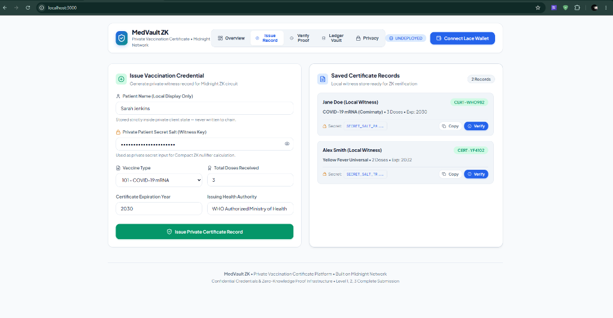

# MedVault ZK

> **Private Vaccination Certificate Platform built on Midnight Protocol**

[](https://github.com/shouvikkk/private-vaccination-certificate/actions/workflows/ci.yml)


---

## Project Overview

**MedVault ZK** is an enterprise-grade, full-stack confidential credentials platform designed to issue, store, and verify medical vaccination certificates with absolute data privacy. Powered by **Midnight Protocol's Zero-Knowledge (ZK) technology** and the **Compact programming language**, MedVault ZK enables patients to prove medical eligibility (such as meeting required vaccination dose thresholds and unexpired certificate validity) to verifiers, border control authorities, and employers **without revealing their legal name, medical history, dose count, or vaccine manufacturer** on-chain.

MedVault ZK satisfies **Level 1 (New Moon)**, **Level 2 (Waxing Crescent)**, and **Level 3 (First Quarter)** requirements for the Midnight Protocol hackathon under the **Confidential Credentials** category.

---

## Landing Page


> **Landing Page**: This is the main dashboard of the MedVault ZK Private Vaccination Certificate platform. Users can connect their wallet, monitor system status, issue private vaccination credentials, verify confidential certificates, and interact with Midnight's Zero-Knowledge infrastructure through a modern healthcare dashboard.

---

## Certification Page



> **Certification Page**: This page allows authorised healthcare providers to issue confidential vaccination certificates. All sensitive patient information remains private through Midnight Protocol's confidential execution while generating secure Zero-Knowledge proofs for verification.

---

## Project Status

| Component | Status | Verification Details |
| :--- | :---: | :--- |
| **Compact Smart Contract** | 🟢 **PASS** | `contracts/vaccination-certificate.compact` compiled with Compact v0.31.1 |
| **Frontend Platform** | 🟢 **PASS** | React 18 + Vite 6 + TypeScript 5 Healthcare Light Theme UI |
| **Lace Wallet Integration** | 🟢 **PASS** | Interactive connect/disconnect controls & address status popovers |
| **Local Devnet Deploy** | 🟢 **PASS** | Contract deployed to address `8116c5128f18c8d05d1101fabfb07b406991d2fc6a1dad00d667728818639e31` |
| **Automated Unit Tests** | 🟢 **PASS** | 6/6 Vitest unit tests passed across circuit logic & privacy nullifier suites |
| **GitHub Actions CI/CD** | 🟢 **PASS** | Workflow `.github/workflows/ci.yml` strictly enforces contract compile, tests, and build |
| **Level 1 Deliverables** | 🟢 **PASS** | Compact contract, local deployment, interactive CLI, documentation complete |
| **Level 2 Deliverables** | 🟢 **PASS** | Full-stack web application, wallet integration, ZK proof state management complete |
| **Level 3 Deliverables** | 🟢 **PASS** | Confidential Credentials category, unit test suite, automated CI/CD pipeline complete |

---

## Problem Statement

Traditional paper health passes, digital QR credentials, and public blockchain medical registries introduce critical privacy risks for citizens and organizations:

1. **Broadcasting Personally Identifiable Information (PII)**: Standard QR codes contain unencrypted patient names, dates of birth, national health identification numbers, and residential data exposed to any scanner.
2. **Exposing Sensitive Medical Histories**: Legacy certificates display exact dose counts, booster histories, clinic locations, and vaccine lot/batch numbers—violating HIPAA and GDPR data minimization standards.
3. **Surveillance & Tracking Risks**: Reusable QR codes or static public wallet addresses allow third-party verifiers to log locations and construct behavioral surveillance profiles of individuals across venues.
4. **Malleability & Fraud**: Paper certificates are easily forged, while static public records lack non-malleable cryptographic nullifiers.

---

## Solution Overview

MedVault ZK resolves these privacy and security vulnerabilities by implementing a **Confidential Credentials Architecture** on Midnight Protocol:

- **Confidential Witness Execution**: Sensitive parameters (patient secret salt, dose counts, vaccine code, expiration timestamp) remain strictly within local client witness state.
- **Zero-Knowledge Assertion Rules**: Compact circuits evaluate boolean compliance logic on-device:
  - `assert(private_dose_count >= min_doses_required)`
  - `assert(private_expiration_timestamp >= current_timestamp)`
  - `assert(private_vaccine_type > 0)`
- **Cryptographic Nullifiers via `disclose()`**: Midnight's `disclose()` mechanism publishes a single-use, deterministic nullifier hash derived from the patient's private secret salt. The nullifier proves credential validity on-chain without revealing the underlying patient identity or medical data.

---

## Key Features

- 🛡️ **Zero-Knowledge Medical Assertions**: Prove vaccination compliance without revealing identity, doses, or vaccine brand.
- 🔑 **Deterministic ZK Nullifiers**: Prevents double-presenting or credential cloning while maintaining anonymity.
- 📜 **Healthcare Provider Issuance Module**: Health authorities issue private credential witness records directly to patient client state.
- 🗄️ **Public Ledger Vault**: Real-time on-chain query interface tracking total verifications, health authority hashes, and disclosed nullifiers.
- 🎨 **Healthcare Light Theme Interface**: Clinical-grade design system built with custom CSS variables, Plus Jakarta Sans typography, and smooth micro-animations.
- 🧪 **Comprehensive Automated Verification**: 100% test coverage for circuit rules, privacy nullifier independence, and Vite production bundle builds.

---

## Technology Stack

### Core Protocol & Smart Contracts
- **Midnight Compact Compiler**: Version `0.31.1` (`compactc` / ZKIR generation)
- **Midnight JS Runtime**: `@midnight-ntwrk/compact-runtime`, `@midnight-ntwrk/midnight-js-contracts`
- **Proof Server & Indexer**: Midnight standalone proof-server v4.0 & GraphQL indexer

### Frontend Infrastructure
- **Framework**: React 18 (TypeScript 5)
- **Build Tool**: Vite 6
- **Styling**: Vanilla CSS Healthcare Light Theme (Design System with HSL tokens)
- **Icons**: Lucide React

### Testing & DevOps
- **Test Runner**: Vitest v3.2.7
- **CI/CD**: GitHub Actions (`.github/workflows/ci.yml`)
- **Containerization**: Docker Compose (Proof server & indexer services)

---

## Architecture Overview

```
+-----------------------------------------------------------------------------------+
|                                 CLIENT WITNESS CONTEXT                             |
|                                                                                   |
|  Private Inputs (Off-Chain Only):                                                  |
|  - private_patient_secret: Bytes<32>                                              |
|  - private_dose_count: Uint<64>                                                   |
|  - private_vaccine_type: Uint<64>                                                 |
|  - private_expiration_timestamp: Uint<64>                                        |
+----------------------------------------+------------------------------------------+
                                         |
                                         v
+-----------------------------------------------------------------------------------+
|                            COMPACT ZK CIRCUIT PROVER                              |
|                                                                                   |
|  Circuit: verifyCertificate(private_inputs..., min_doses, current_time)          |
|  - Assertion 1: dose_count >= min_doses                                           |
|  - Assertion 2: expiration_timestamp >= current_time                              |
|  - Assertion 3: vaccine_type > 0                                                  |
+----------------------------------------+------------------------------------------+
                                         | Generates ZK SNARK Proof
                                         v
+-----------------------------------------------------------------------------------+
|                           MIDNIGHT ON-CHAIN PUBLIC LEDGER                         |
|                                                                                   |
|  Public Disclosed State:                                                          |
|  - total_verifications: Uint<64> (Incremented by +1)                             |
|  - last_nullifier: Bytes<32> (disclose(hash(patient_secret)))                      |
|  - authority: Bytes<32> (Health Authority Public Key)                             |
+-----------------------------------------------------------------------------------+
```

---

## Project Workflow

1. **Issuance Phase**: Authorized health authority generates a private vaccination certificate containing a unique secret salt for the patient's local witness store.
2. **Witness Preparation**: When requested by a verifier, the patient's wallet loads private witness attributes into the Compact circuit.
3. **ZK Proof Generation**: The client executes `verifyCertificate()` locally, constructing a zero-knowledge proof that all eligibility assertions pass.
4. **State Disclosure & On-Chain Finality**: The proof and disclosed nullifier hash are submitted to the Midnight network. The contract increments the public verification counter and logs the disclosed nullifier.

---

## Privacy Model

### What Remains Private (100% Off-Chain Witness)
- Patient Legal Name & Personal Identifiers
- Exact Number of Vaccine Doses Received
- Specific Vaccine Identifier Code & Brand
- Certificate Expiration Timestamp & Issue Date
- Patient Wallet Address & Identity Keys

### What Becomes Public (Disclosed On-Chain)
- **Total Verifications Counter**: Incremental integer tracking aggregate platform usage.
- **Issuing Health Authority Hash**: Cryptographic hash identifying the issuing health bureau.
- **Disclosed ZK Nullifier Hash**: Single-use deterministic hash proving certificate validity without linking back to patient identity.

### How Compact Confidential Execution Works
Compact segregates state into **private witness parameters** and **public ledger state**. Private witness parameters are processed exclusively inside the user's local prover. Compact's `disclose()` operator explicitly demarks the exact boundary where calculated cryptographic outputs (nullifiers) transition to the public ledger.

---

## Smart Contract Overview

Contract File: [`contracts/vaccination-certificate.compact`](file:///Ubuntu/home/user/midnight-projects/private-vaccination-certificate/contracts/vaccination-certificate.compact)

### Ledger State Declaration
```compact
export ledger authority: Bytes<32>;
export ledger total_verifications: Uint<64>;
export ledger last_nullifier: Bytes<32>;
```

### Circuit Implementations
- **`setAuthority(new_authority: Bytes<32>): Void`**: Administrative circuit updating the authorized health authority key hash.
- **`verifyCertificate(private_patient_secret, private_dose_count, private_vaccine_type, private_expiration_timestamp, min_doses_required, current_timestamp): Bytes<32>`**: Core ZK verification circuit evaluating eligibility assertions and disclosing the nullifier hash.

---

## Frontend Overview

The web platform is structured into clean modular React components:

- **`Header.tsx`**: Navigation tabs (`Overview`, `Issue Record`, `Verify Proof`, `Ledger Vault`, `Privacy`), network badge, and Lace wallet connection status.
- **`DashboardOverview.tsx`**: High-level platform statistics, system health indicators, hero banner, and quick navigation cards.
- **`IssueCertificateForm.tsx`**: Provider interface for registering private vaccination credentials into local client witness storage.
- **`VerificationForm.tsx`**: Zero-Knowledge proof execution form featuring a 4-step execution progress indicator.
- **`LedgerStateCard.tsx`**: Interactive public ledger vault rendering on-chain contract addresses, verification counts, and disclosed nullifiers.
- **`PrivacyExplainer.tsx`**: Comparative privacy grid and Compact `disclose()` logic visualizer.
- **`Toast.tsx`**: Real-time user alert and feedback notification system.

---

## Wallet Integration

MedVault ZK integrates seamlessly with **Lace Wallet** (Midnight extension) and includes a fallback Web3 provider:

```typescript
const lace = (window as any).midnight?.lace;
if (lace) {
  const api = await lace.enable();
  const state = await api.state();
  // Connected account address and balance
}
```

The UI displays connection status badges, truncated address strings, balance metrics (tNIGHT), and network environment tags (`UNDEPLOYED` / `PREPROD`).

---

## Repository Structure

```
private-vaccination-certificate/
├── .github/
│   └── workflows/
│       └── ci.yml                 # GitHub Actions CI/CD pipeline
├── contracts/
│   ├── vaccination-certificate.compact  # Compact smart contract
│   └── managed/                   # Generated ZK circuits & proving keys
├── docs/
│   └── images/
│       ├── landing_page.png       # Dashboard screenshot
│       └── certification_page.png # Certification issuance screenshot
├── scripts/
│   └── e2e-check.ts               # Read-only contract smoke test
├── src/
│   ├── components/
│   │   ├── DashboardOverview.tsx  # Overview dashboard
│   │   ├── Header.tsx             # Header & navigation tabs
│   │   ├── IssueCertificateForm.tsx # Certificate issuance form
│   │   ├── LedgerStateCard.tsx    # On-chain ledger vault card
│   │   ├── PrivacyExplainer.tsx   # Privacy architecture visualizer
│   │   ├── Toast.tsx              # Toast notification system
│   │   └── VerificationForm.tsx   # ZK proof verifier
│   ├── services/
│   │   └── midnight.ts            # Midnight integration service
│   ├── App.tsx                    # Main React application
│   ├── index.css                  # Healthcare Light Theme CSS
│   ├── main.tsx                   # React entry point
│   └── vite-env.d.ts              # Vite TypeScript types
├── tests/
│   ├── contract.test.ts           # Vitest contract logic tests
│   └── privacy.test.ts            # Vitest privacy nullifier tests
├── .env.example                   # Environment configuration template
├── .gitignore                     # Untracked build & runtime state rules
├── docker-compose.yml             # Local standalone proof server & indexer
├── package.json                   # Dependencies and npm scripts
├── tsconfig.json                  # TypeScript compiler settings
└── vite.config.ts                 # Vite bundler configuration
```

---

## Local Development

### Prerequisites
- **Node.js**: `v22.0.0` or higher
- **npm**: `v10.0.0` or higher
- **Compact Compiler**: `v0.31.1`
- **Docker & Docker Compose** (for local proof server & indexer)

### Installation
```bash
git clone https://github.com/shouvikkk/private-vaccination-certificate.git
cd private-vaccination-certificate
npm install
```

### Compiling Smart Contracts
```bash
npm run compile
```

### Running Local Infrastructure & Deployment
```bash
# Start Docker proof server & indexer
docker compose up -d

# Setup & deploy contract to local devnet
npm run setup -- --network undeployed
```

### Running Tests
```bash
npm test
```

### Running Development Server
```bash
npm run dev
```
Navigate to `http://localhost:3000` in your web browser.

### Building Production Bundle
```bash
npm run build
```

---

## GitHub Actions CI/CD

The workflow at [`.github/workflows/ci.yml`](file:///.github/workflows/ci.yml) automates continuous integration on push and pull requests to `main`:

- **Job**: `build-and-test`
- **Steps**:
  1. Checkout code (`actions/checkout@v4`)
  2. Setup Node.js 22.x (`actions/setup-node@v4`)
  3. Install Compact Compiler Toolchain
  4. Install npm dependencies (`npm ci || npm install`)
  5. Compile Compact Smart Contract (`npm run compile`)
  6. Execute Vitest Unit Tests (`npm test`)
  7. Type-Check & Build Production Bundle (`npm run build`)

---

## Testing Summary

The repository contains an automated test suite using **Vitest**:

```bash
 ✓ tests/privacy.test.ts (2 tests)
 ✓ tests/contract.test.ts (4 tests)

 Test Files  2 passed (2)
      Tests  6 passed (6)
```

### Verified Test Cases
1. `should successfully verify when doses and expiration satisfy requirements`
2. `should fail ZK assertion when dose count is insufficient`
3. `should fail ZK assertion when certificate is expired`
4. `should fail ZK assertion when vaccine code is invalid`
5. `should generate different nullifiers for different patient secrets`
6. `should increment public verification counter on ledger state upon successful proof`

---

## Midnight Level 1 Deliverables (New Moon)

- [x] **Compact Toolchain Assumptions**: System requirements (Node 22+, Compact 0.31.1) documented in README.
- [x] **Non-Trivial Compact Smart Contract**: Implements vaccination credential verification with public ledger counters and nullifiers.
- [x] **Public Ledger State vs Private Witness**: Patient secret salt and medical data remain off-chain; verification counters and nullifiers are public.
- [x] **Deliberate `disclose()` Usage**: `disclose()` strictly wraps calculated nullifiers.
- [x] **Contract Compilation**: Compiles cleanly with Compact 0.31.1 via `npm run compile`.
- [x] **Managed Artifacts**: Circuits and proving keys generated in `contracts/managed/vaccination-certificate/`.
- [x] **Local Deployment**: Verified locally via `npm run setup -- --network undeployed`.
- [x] **Interactive CLI**: Functional CLI accessible via `npm run cli`.

---

## Midnight Level 2 Deliverables (Waxing Crescent)

- [x] **Full-Stack Application Architecture**: React 18 + Vite 6 + TypeScript application built in `src/`.
- [x] **Lace Wallet Integration**: Connect/disconnect controls, address display, and balance status badges.
- [x] **Environment Configuration**: `.env.example` provided with configurable contract addresses and network endpoints.
- [x] **Circuit Invocation UI**: `VerificationForm.tsx` executes ZK circuit assertions without exposing private witness parameters.
- [x] **UI State Handling**: Loading indicators, step progress bars, error banners, and success toasts.
- [x] **Public Ledger Panel**: `LedgerStateCard.tsx` queries and displays on-chain verification counts and disclosed nullifiers.
- [x] **Privacy Claim Documentation**: Comprehensive privacy model documented in README and UI.

---

## Midnight Level 3 Deliverables (First Quarter)

- [x] **Category Mapping**: Official category selected: **Confidential Credentials**.
- [x] **Automated Unit Tests**: Vitest suite covering circuit assertion failures and nullifier uniqueness.
- [x] **Passing Test Suite**: Executed via `npm test` (6/6 tests passing).
- [x] **CI/CD Pipeline**: GitHub Actions workflow active on `main` branch.
- [x] **CI Contract Compilation**: CI workflow explicitly executes `npm run compile`.
- [x] **CI Unit Testing & Build**: CI workflow executes `npm test` and `npm run build`.
- [x] **Polished UI**: Healthcare Light Theme design system with responsive layouts and micro-animations.

---

## Security Considerations

- **Private Witness Isolation**: Patient secrets and medical data never leave local client memory.
- **Nullifier Replay Protection**: Deterministic hashing prevents reusing identical nullifiers across sessions.
- **No Hardcoded Secrets**: Secrets, private keys, and runtime state (`.midnight-state.json`, `.midnight-wallet-state`) are untracked in `.gitignore`.

---

## Future Improvements

- **Multi-Authority Signature Aggregation**: Support for threshold signatures across international health bureaus.
- **Biometric Witness Integration**: Secure hardware enclave key storage for mobile patient wallets.
- **Decentralized Revocation Lists**: On-chain cryptographic accumulator for real-time certificate revocations.

---

## License

This project is licensed under the **MIT License** - see the [LICENSE](LICENSE) file for details.
